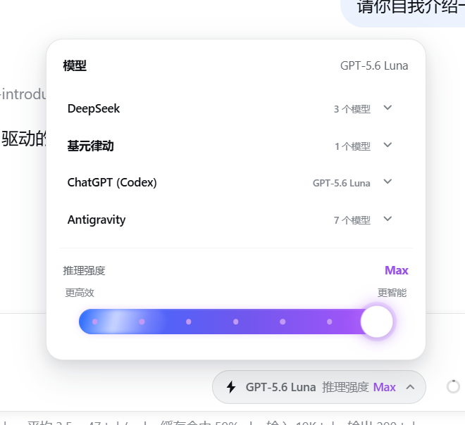
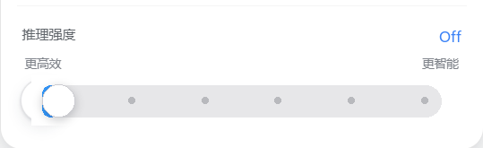

# dsh-reasoning-effort

[](https://www.npmjs.com/package/dsh-reasoning-effort)
[](https://www.npmjs.com/package/dsh-reasoning-effort)
[](https://github.com/Mu-scorpio/dsh-reasoning-effort)
[](LICENSE)

> 为 DeepSeek Harness 中的任意模型设置推理强度，并在最高档点亮紫色动态特效。

`dsh-reasoning-effort` 是一个独立的 DSH Bundle，用来补齐和管理模型的推理强度配置。它不限制 Provider 或模型品牌：只要模型已经接入 DeepSeek Harness，就可以为它声明默认等级、模型级覆盖和实际协议值映射。



_模型选择器按 Provider 折叠分组；可以为任意已接入模型配置推理强度，滑到最高级时会出现紫色辉光、边缘闪烁和拖尾特效。_



_滑块会实时显示当前档位；到达最高级时，紫色发光效果会持续提示当前状态。_

## 核心能力

- 为任意已接入 Harness 的模型配置推理强度，不受 Provider 限制；
- 支持 `off`、`minimal`、`low`、`medium`、`high`、`xhigh` 和 `max` 等等级；
- 支持 Provider 默认值、模型级覆盖和协议 wire 值映射；
- 模型选择器按 Provider 分组折叠，先选 Provider，再选模型；
- 推理强度滑块采用粗轨道和离散档位，最高档带紫色辉光、闪烁和拖尾；
- 模型切换先在前端暂存，关闭选择框时再提交，避免界面闪回；
- 以追加方式更新 settings，不覆盖已有声明。

## 安装

将 npm 上已构建的 Bundle 安装到 DSH web profile，然后重启正在运行的 Harness：

```sh
dsh plugin --profile web add -w --config.auto-install-peers=false dsh-reasoning-effort
dsh web
```

包已经发布了预构建产物，正常安装不需要从源码编译插件。

## 配置

Bundle 已内置 `cliproxyapi` 和 `jyld` 的示例配置。需要配置其他 Provider 时，在最终使用的 Cordis patch 中覆盖 `reasoning-effort` loader：

```yaml
- insert:
    - id: reasoning-effort
      name: dsh-reasoning-effort
      config:
        providers:
          my-provider:
            api: openai-responses
            reasoning: medium
            efforts:
              low: low
              medium: medium
              high: high
              xhigh: xhigh
              max: max
            models:
              my-reasoning-model:
                efforts:
                  high: reasoning_high
```

### 配置字段

| 字段 | 作用 |
| --- | --- |
| `api` | 选择 Provider 协议对应的默认 wire 值映射。 |
| `reasoning` | 仅在 Provider 没有该设置时，补充默认推理等级。 |
| `efforts` | 覆盖 Harness 各等级实际发送的字符串。 |
| `models.<id>.efforts` | 单独覆盖某个模型的映射。 |
| `models.<id>.disabled` | 显式标记某个模型不使用推理强度。 |

Harness 支持的等级为 `off`、`minimal`、`low`、`medium`、`high`、`xhigh` 和 `max`。内置协议映射覆盖 `low` 到 `max` 五个常用等级；特殊网关可以自行提供对应的实际值。

> Provider 必须已经存在于 `llm-pi-ai` settings 中。插件只增强现有 Provider，不会重新创建已经被删除的 Provider。

## 输入框推理条

浏览器端会读取当前模型公布的推理等级，把这些等级绘制成离散滑块，并通过 DSH 共享的模型目录提交选择。拖动过程中，文字、填充条和最高档特效在前端实时更新；松手后才把最终强度提交给后端。

模型选择器中的模型切换也采用前端暂存机制：点击模型时立即更新界面，但不会立即改写后台模型；关闭选择框时，最后选中的模型和推理强度才会一起提交。这样可以避免后台旧状态回写造成闪回。

没有推理元数据的模型不会显示空控件。

## 默认安全策略

这个插件可以和已有 DSH 配置并排工作：

- 已有的 `reasoningEfforts` 永远不会被覆盖，包括 `false`；
- 模型中与推理无关的字段保持不变；
- `llm-pi-ai` 延迟注册时会短暂重试；
- settings 更新后会重新执行一次追加同步；
- 不新增 Provider 凭据、请求、工具或遥测。

换句话说，它只准备好 settings 契约，具体的模型控制仍交给 DSH 自己完成。

## 本地开发

通过本地 overlay 运行与发布 Bundle 相同的配置：

```sh
pnpm install --config.auto-install-peers=false
npm run build
dsh web --patch ./cordis.yml
```

`cordis.yml` 会挂载 `src/index.ts`，并使用与 Bundle patch 相同的示例配置。

## 许可证

MIT
