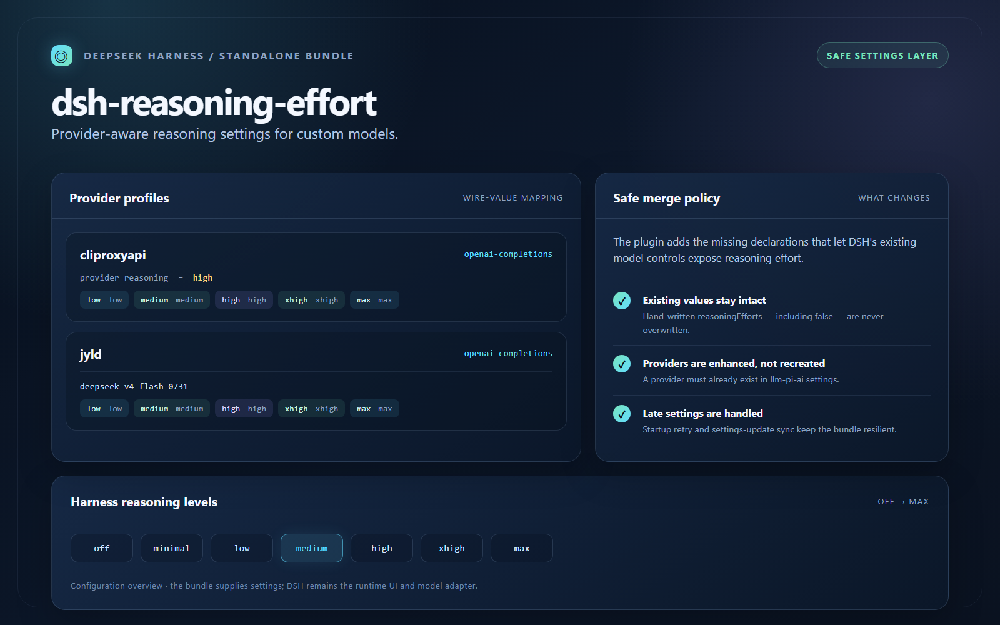
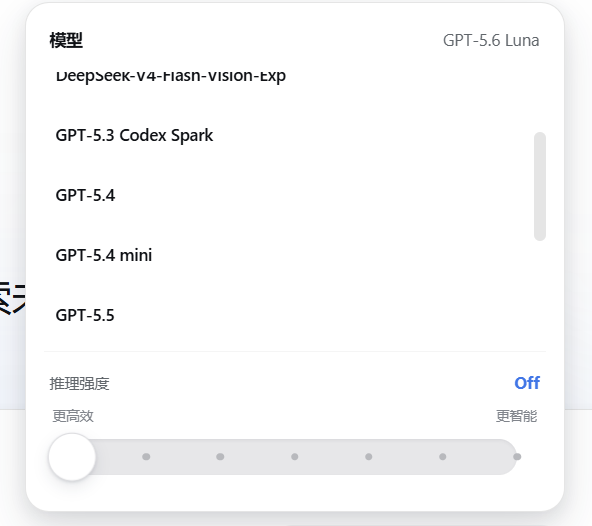

# dsh-reasoning-effort

[](https://www.npmjs.com/package/dsh-reasoning-effort)
[](https://www.npmjs.com/package/dsh-reasoning-effort)
[](https://github.com/Mu-scorpio/dsh-reasoning-effort)
[](LICENSE)

> Give custom DeepSeek Harness providers a reasoning-effort vocabulary they can actually use.

`dsh-reasoning-effort` is a small, standalone DSH Bundle that fills missing
reasoning-effort declarations in the `llm-pi-ai` settings namespace. It lets
you define provider defaults, model-specific mappings, and protocol wire values
without replacing the settings that are already there.



_Configuration overview: the bundle supplies settings; DSH remains the runtime
UI and model adapter._



_The plugin keeps the model chooser and reasoning levels together in one focused
popover._


_The GIF previews the slider moving through discrete levels; the maximum level
switches to a purple glow, edge flash, and sweeping tail._

## Why it exists

Different providers describe the same idea in different dialects. One accepts
`low` / `medium` / `high`; another needs a provider-specific value; a third
needs a model-level exception. This plugin gives those models one stable
Harness-facing set of levels while keeping the wire-value mapping configurable.

The result is deliberately narrow:

- provider-aware defaults for common DSH adapter protocols;
- per-provider and per-model effort mappings;
- a provider-level default reasoning setting;
- explicit model opt-out with `disabled: true`;
- safe, additive settings updates that preserve existing declarations.
- a provider-aware slider beside the composer send button;
- one shared selection path with DSH's built-in model menu;
- a clear purple max-level effect when the highest advertised effort is active.

## Install

Install the published Bundle into the DSH web profile, then restart the
running Harness:

```sh
dsh plugin --profile web add -w --config.auto-install-peers=false dsh-reasoning-effort
dsh web
```

The package is prebuilt on npm, so normal installs do not need to compile the
plugin from source.

## Configure

The Bundle ships with examples for `cliproxyapi` and `jyld`. To configure
another provider, add an override for the `reasoning-effort` loader in your
final Cordis patch:

```yaml
- insert:
    - id: reasoning-effort
      name: dsh-reasoning-effort
      config:
        providers:
          my-provider:
            api: openai-responses
            reasoning: medium
            efforts:
              low: low
              medium: medium
              high: high
              xhigh: xhigh
              max: max
            models:
              my-reasoning-model:
                efforts:
                  high: reasoning_high
```

### Configuration rules

| Field | Meaning |
| --- | --- |
| `api` | Selects the default wire-value map for a provider protocol. |
| `reasoning` | Sets a provider-level default reasoning level when one is missing. |
| `efforts` | Overrides the values sent for the generic Harness levels. |
| `models.<id>.efforts` | Overrides the map for one model. |
| `models.<id>.disabled` | Explicitly marks one model as non-reasoning. |

The available Harness levels are `off`, `minimal`, `low`, `medium`, `high`,
`xhigh`, and `max`. The built-in protocol maps cover the five common levels
from `low` through `max`; custom gateways can provide their own values.

> Providers must already exist in the `llm-pi-ai` settings. The plugin enhances
> an existing provider; it does not recreate one that has been removed.

## Safe by default

This plugin is designed to sit beside existing DSH configuration:

- existing `reasoningEfforts` values are never overwritten, including `false`;
- model fields unrelated to reasoning effort are preserved;
- settings are retried briefly when `llm-pi-ai` registers late;
- settings updates trigger a fresh additive sync;
- no provider credentials, requests, tools, or telemetry are added.

In other words, it prepares the settings contract and lets DSH's existing
model controls do the rest.

## Composer control

The client half reads the active model's advertised effort list, renders those
levels as a discrete slider, and sends the selected value through DSH's shared
model directory. During a drag, the label, fill, and maximum-level effect update
locally in real time; only the released position is committed to the backend.
Models without reasoning metadata simply do not get an empty control.

## Local development

Run the published-style Bundle through the local overlay:

```sh
pnpm install --config.auto-install-peers=false
npm run build
dsh web --patch ./cordis.yml
```

`cordis.yml` mounts `src/index.ts` with the same example configuration used by
the Bundle patch.

## License

MIT
